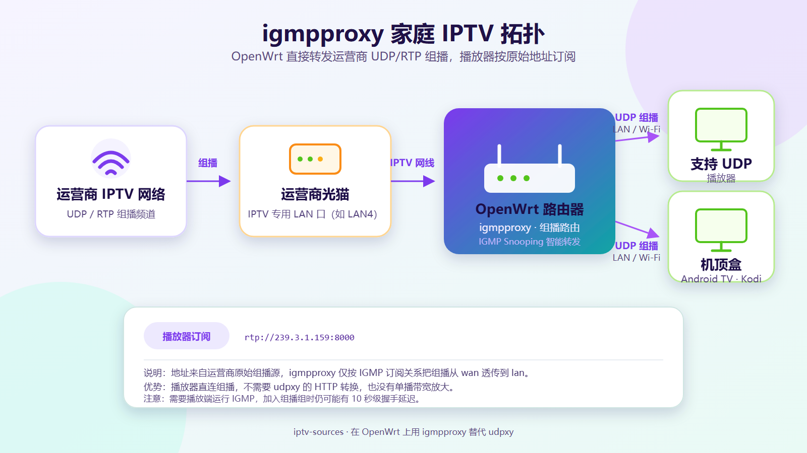
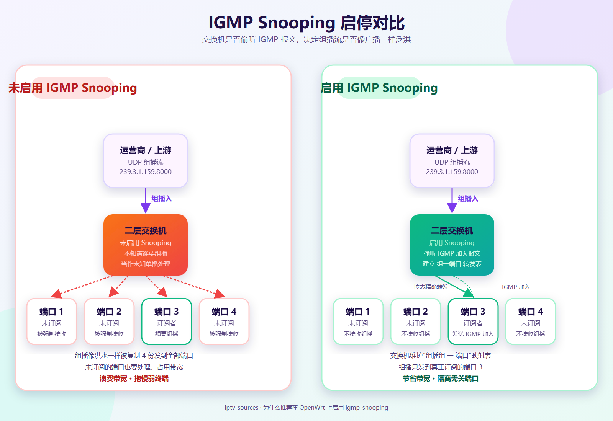
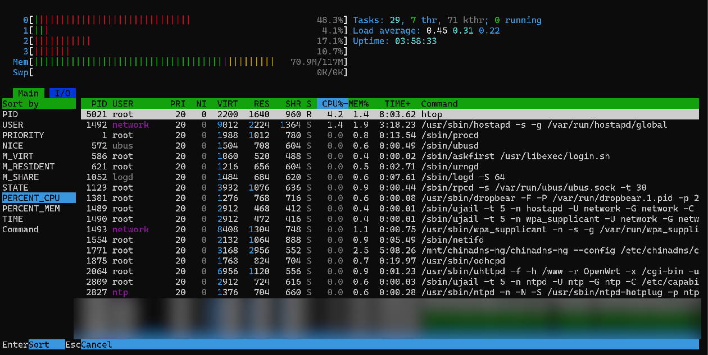
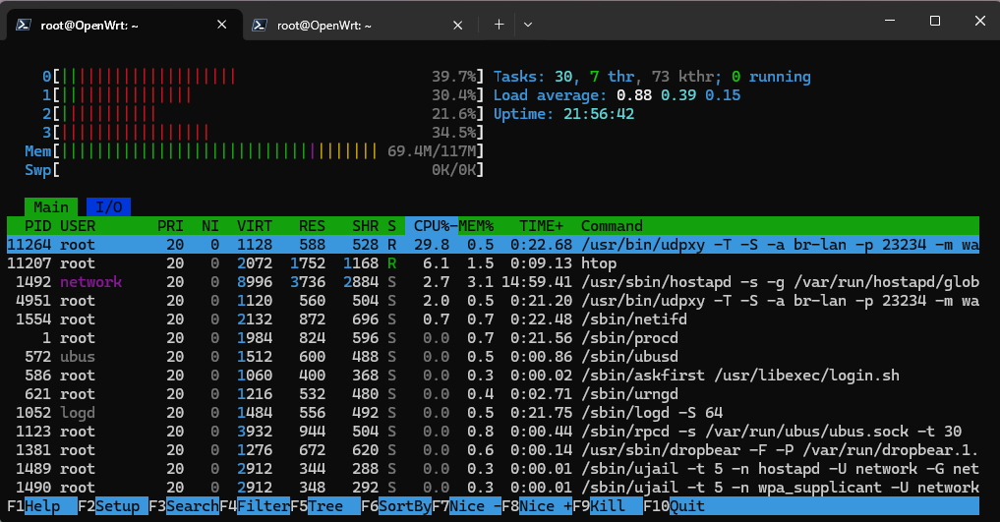

# 在 OpenWrt 上用 igmpproxy 直放 UDP 组播

上一篇文章 [《在安卓机顶盒中看宽带运营商 IPTV》](https://mp.weixin.qq.com/s/2BK9NeseH6v-BfGyUl9bGQ) 发布之后，不少读者反馈说其实不用 udpxy，**直接播放 UDP 地址也可以**。这种说法让我挺好奇的，于是决定亲自验证一下。

## 一、为什么可以不走 udpxy

先简单回顾一下：运营商 IPTV 频道通常通过光猫的 IPTV 专用 LAN 口下发，使用 UDP/RTP 组播传输。上一篇文章为了让 Kodi、TVBox 这类习惯 HTTP 单播的播放器也能订阅频道，引入了 udpxy 做：

```text
UDP/RTP 组播 → HTTP 单播
```

但 UDP 组播也是一组“开放”的协议，本身并不需要鉴权（至少在常见运营商 IPTV 场景下）。只要：

- 设备已经接入光猫的 IPTV 专用 LAN 口；
- 播放端运行了 IGMP 协议；
- 播放器本身支持 UDP/RTP 输入

那么播放端就可以自己发起 IGMP 加入请求，运营商机顶盒做的事情，理论上电脑或盒子也能做一遍。

网上确实有一些支持 UDP 协议的播放器，例如 Windows 上的 VLC、PotPlayer、MPV，以及 Android TV 上的 Kodi、电视直播类 App 等。

---

## 二、第一阶段：电脑直连光猫 IPTV 口

家里暂时没有额外空间放置机顶盒和显示器，于是我先把笔记本电脑（Win11）直接接到光猫的 IPTV 专用 LAN 口上，北京联通宽带，组播源使用 [iptv-sources2](https://iptv-sources2.pages.dev/) 提供的：

```text
https://iptv-sources2.pages.dev/q_bj_iptv_unicom_m.m3u
```

测试时发现：

- 第一次点开某个频道，需要等 **十几秒** 才开始出画面。猜测是 IGMP 加入、组播源路径下发送条件建立等过程，类似一次“握手”；
- 一旦稳定下来，播放过程是顺畅的，切换频道时也会再次出现类似的等待；

这条路虽然简单，但代价是网线必须一直插在电脑上； 电脑被“绑死”在光猫附近，失去了无线、移动的便利性。

显然，如果想在家里正常用，还是得把组播代理“挪”到无线路由器上去。

---

## 三、改造思路：把组播代理搬到路由器

udpxy 之所以常见，是因为它能把组播转换成 HTTP 单播。但其实 OpenWrt 上还有另一种思路：**保留组播本身**，让路由器只负责把上游组播按订阅关系透传到下游。这就是 **igmpproxy** 的角色。

igmpproxy 是一个轻量的 IGMP 代理：

- 上游接口订阅组播组 → 自动帮下游向上发起 IGMP 加入；
- 下游接口收到 IGMP 加入 → 在内部维护一份“组 → 下游接口”的映射；
- 组播数据到达上游接口时，只往真正订阅的下游接口转发；
- 不做应用层协议转换，CPU 占用本应低于 udpxy。

这一点比 udpxy 干净不少：

```text
udpxy  : UDP 组播 → 应用层解析 → HTTP 单播（需要解析 RTSP/RTP，多一层 CPU 活）
igmpproxy: 直接复用 IGMP 协议，按二层/三层规则转发
```

---

## 四、家庭拓扑



整条链路非常短：

1. 运营商通过 UDP/RTP 组播发送 IPTV 频道；
2. 光猫从 IPTV 专用 LAN 口输出；
3. OpenWrt 路由器（这里是小米 AC2100，刷 OpenWrt）的 IPTV 接口接收组播；
4. igmpproxy 按订阅关系把组播透传到内网；
5. 支持 UDP 组播的设备（电脑 / 机顶盒）按原始 `rtp://` 地址订阅。

播放器订阅的地址和 udpxy 方案不同，**依然是运营商原始的 rtp 地址**：

```text
rtp://239.3.1.159:8000
```

也就是说，路由器上没有端口转换，也没有 URL 改写，组播流量一直保持原样。

---

## 五、OpenWrt 上的完整配置

下面把配置过程完整记录下来，前提是把路由器用来接收 IPTV 的网口接到光猫 IPTV 专用 LAN 口。

### 1. 安装 igmpproxy

```bash
opkg update
opkg install igmpproxy
```

### 2. 写入 igmpproxy 配置

```shell
cat > /etc/config/igmpproxy <<'EOF'
config igmpproxy
	option quickleave '1'

config phyint
	option network 'wan'
	option zone 'wan'
	option direction 'upstream'
	list altnet '0.0.0.0/0'

config phyint
	option network 'lan'
	option zone 'lan'
	option direction 'downstream'
EOF
```

各项的含义：

| 配置项 | 含义 |
|--------|------|
| `quickleave` | 下游设备离开组时立即向上游发 IGMP Leave，减少频道切换延迟 |
| `network wan` / `direction upstream` | 上游接口：接收运营商 IPTV 组播 |
| `network lan` / `direction downstream` | 下游接口：向电脑、手机、电视等客户端转发组播 |
| `altnet 0.0.0.0/0` | 允许任意上游组播源，先用于测试 |

> 如果后续确认运营商组播源地址范围，例如全部来自某个网段，可以把 `0.0.0.0/0` 收紧。

### 3. 启动并验证

```shell
/etc/init.d/igmpproxy enable
/etc/init.d/igmpproxy restart

/etc/init.d/igmpproxy status
```

正常情况下，`status` 命令会输出 `running`。同时可以通过日志确认上游 IGMP 加入是否成功：

```shell
logread | grep igmpproxy
```

当某个播放器发起 `rtp://239.3.1.159:8000` 订阅时，日志里通常会出现：

```text
igmpproxy: adding membership for 239.3.1.159 on wan
igmpproxy: adding membership for 239.3.1.159 on lan
```

表示组播已经按订阅关系建立。

### 4. 打开 IGMP Snooping

igmpproxy 解决了“组播从上游到下游的通路”问题，但下游内部（比如路由器内部的交换芯片、Wi-Fi 接入侧）依然会按交换机的默认行为把组播当成未知单播处理。**强烈建议同时打开 IGMP Snooping**：

```bash
uci set network.@device[0].igmp_snooping='1'
uci commit network
/etc/init.d/network reload
```

> **IGMP Snooping** 是二层交换机用来“偷听”三层 IGMP 报文，从而知道哪些交换机端口真正需要接收某个 IPv4 组播流量的机制。
>
> 如果不启用 IGMP Snooping，交换机通常不知道某个组播 MAC 地址对应哪些接收者，于是会把组播报文像广播一样泛洪到 VLAN 内多个端口。启用后，交换机会维护一张“组播组 → 端口”的转发表，只把组播数据发送到实际加入了该组的端口。

下面这张图直观展示了差异：



启用前，同一个组播流量会被复制到 LAN 上每一个端口；启用后，只发给订阅了的端口。对 4K IPTV 而言，这往往意味着 LAN 上其他无关设备的网速不再被组播抢占。

---

## 六、CPU 占用：igmpproxy 反而比 udpxy 高？

把 udpxy 和 igmpproxy 都跑起来以后，我用 htop 在小米 AC2100（MT7621A，双核 800 MHz）上做了简单对比：

**igmpproxy 运行时：**



**udpxy 运行时：**



从这两张截图可以读到：

| 指标 | igmpproxy | udpxy |
|------|-----------|-------|
| 整机 CPU 占用（CPU 栏） | 约 **48.3%** | 约 **39.7%** |
| Load Average（1/5/15 分钟） | 0.45 / 0.31 / 0.22 | 0.88 / 0.39 / 0.15 |
| 进程自身 CPU 占用 | 看不到单一进程吃满 | udpxy 进程自身约 **29.8%** |
| 内存占用 | 约 70.9 MB | 约 69.4 MB |

直观上 igmpproxy “不做事”，但整机 CPU 反而略高于 udpxy。这其实有几个原因，并不代表 igmpproxy 性能更差：

1. **IGMP 协议本身就有持续开销**
   igmpproxy 要周期性发送 IGMP 查询响应、维护组成员关系表、刷新转发表，每隔一段时间就会有一波“协议层面”的脉冲式 CPU 占用，整体呈现一条不断抖动的曲线。

2. **组播转发不是纯转发**
   - udpxy 工作在应用层：拿到一个 UDP 包，复制到 HTTP socket 写出去；
   - igmpproxy 工作在协议栈层面：组播包需要在内核里被识别、按接口转出，MT7621 这种老 SoC 的网络栈加速能力有限，每次转发都要走一遍路由查找和套接字缓冲区。

3. **“整机 CPU”和“进程 CPU”是两回事**
   从 htop 看，udpxy 是一个进程集中吃满 29.8%；igmpproxy 自身的 CPU 占用很低，但它的负担被分散到了内核协议栈、中断和软中断里，于是整机 CPU 看起来反而更高。如果只看 igmpproxy 进程那一行，你甚至会觉得“它什么都没干”，可整机 CPU 已经在忙了。

4. **测试时机不完全可比**
   截图 1 和截图 2 是不同时间点的瞬时画面。udpxy 的 Load Average 反而是更高的（0.88），igmpproxy 这边更低（0.45），说明 udpxy 进程更可能在某个时间点上集中阻塞。长期来看两者的差异并没有“数量级”的差别，对 MT7621A 这类入门级路由来说都是可接受的。

> 如果你的路由器 CPU 性能本身就不算强（MT7621、MT7628、IPQ40xx 等），建议：
>
> - 单台设备观看为主，不要同时开 4K + 多客户端；
> - 配合 IGMP Snooping 减少不必要的组播泛洪；
> - 频道切换时，IGMP 加入的“十几秒”等待是协议特性，不属于性能问题。

---

## 七、和 udpxy 方案的对比

| 维度 | udpxy | igmpproxy |
|------|-------|-----------|
| 协议转换 | UDP/RTP 组播 → HTTP 单播 | 无，保持原始组播 |
| 播放器要求 | 任意 HTTP 播放器 | 必须支持 UDP/RTP 输入 |
| 频道地址 | 走 udpxy `:xxx/rtp/...` 形式 | 直接使用运营商 `rtp://...` |
| 单播带宽放大 | 有（每个客户端一份拷贝） | 无（IGMP 共享一份组播） |
| CPU 占用 | 单进程可预测 | 分散在内核/中断，整体略高 |
| 部署复杂度 | 需要放行防火墙规则 | 需要透传 IGMP/组播流量 |

两种方案其实并不冲突：

- 如果家里主要是 **Android TV / Kodi / TVBox / VLC** 等支持 UDP 的设备，igmpproxy 是更轻的选择；
- 如果有设备只能用 HTTP，udpxy 仍然是最稳的方案。

> 上一篇文章里 iptv-sources 项目生成的运营商 IPTV M3U 默认指向 udpxy 转换后的 HTTP 地址，**这套方案不需要修改 M3U 即可照常使用**。如果你切换到 igmpproxy，可以直接订阅原始组播版本的 M3U，例如：
>
> ```text
> https://iptv-sources2.pages.dev/q_bj_iptv_unicom_m.m3u
> ```
>
> 这份播放列表里的频道地址就是运营商原始的 `rtp://` 组播源，搭配 igmpproxy 即可播放。

---

## 八、小结

- 上一篇文章里用 udpxy 把组播转成 HTTP 单播，是为了兼容不能直接处理组播的播放器；
- 如果客户端本身支持 UDP/RTP，**完全可以跳过 udpxy，直接播放组播地址**；
- 在 OpenWrt 里完成这件事的工具是 igmpproxy：安装一行命令，配置简单；
- 强烈建议同时开启 IGMP Snooping，避免组播在内网被无意义地泛洪；
- 在性能较弱的路由器（MT7621A 等）上，igmpproxy 整机 CPU 看起来略高于 udpxy，但这是协议栈和中断层面的开销，并不是“更慢”；
- udpxy 和 igmpproxy 各有适用场景，**它们不是非此即彼的关系**。

最终，家庭里的 IPTV 播放可以根据客户端能力灵活选择：

- 客户端支持 UDP → 用 igmpproxy；
- 客户端只支持 HTTP → 用 udpxy；
- 两者并存 → igmpproxy 提供组播通路，udpxy 提供 HTTP 兼容层，互不干扰。
