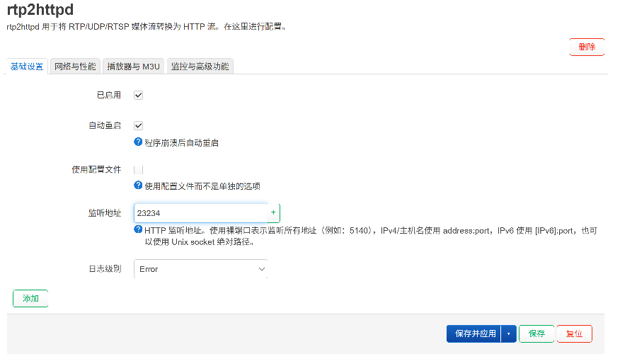
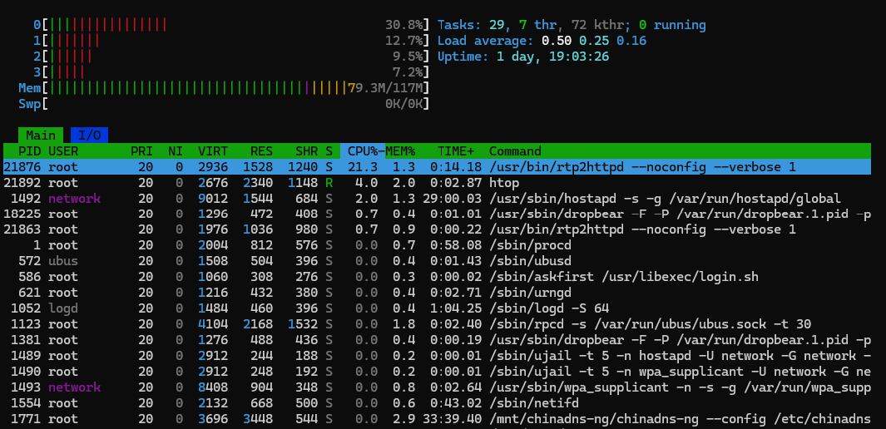

# 用 rtp2httpd 转发宽带运营商 IPTV 组播

前些天发表[《在安卓机顶盒中看宽带运营商 IPTV》](https://mp.weixin.qq.com/s/2BK9NeseH6v-BfGyUl9bGQ) 时提到运营商组播代理工具用的是 udpxy，但是部分网友说使用 rtp2httpd 性能更好。所以我又实地测试了一下 rtp2httpd 这款组播转单播软件。

rtp2httpd 官方文档中说其已经上架了若干家 openwrt 的变种操作系统的应用商店，其中就包括我用的 ImmortalWrt，但是实测发现在我的设备上找不到安装包，估计是由于我用的版本过低（23 版本）。所以还是用官方提供的安装脚本来一键安装：

```shell
uclient-fetch -q -O - https://raw.githubusercontent.com/stackia/rtp2httpd/main/scripts/install-openwrt.sh | sh
```

安装完成后，它是自带 openwrt 管理 UI的，在 openwrt 的 **服务** 菜单中能找到 **rtp2httpd** 的子菜单，点开 **基础设置** 的标签页，将 **已启用** 的复选框选中，顺便勾选上 **自动重启**（程序崩溃后自动重启）。**监听地址** 默认是 `5140`，这里改成我们项目中生成的 m3u 文件所用的 `23234`，这样项目中的 m3u 文件可以直接用。



配置完成后点击按钮 **保存并应用**，等待其生效。生效后，就可以做测试了，我找了一个 4K 视频，跟 udpxy 做对比，CPU 占用果然要低。

**rtp2httpd 运行时：**



**udpxy 运行时：**


从这两张截图可以读到：

| 指标 | rtp2httpd | udpxy |
|------|-----------|-------|
| 进程自身 CPU 占用 | 约 **21.3%** | 约 **29.8%** |
| CPU0 占用 | 约 **30.8%** | 约 **39.7%** |
| Load Average（1/5/15 分钟） | 0.50 / 0.25 / 0.16 | 0.88 / 0.39 / 0.15 |
